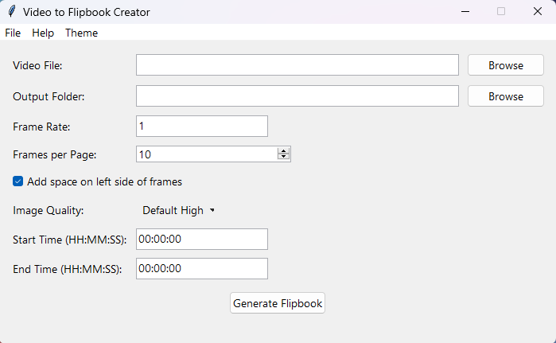

# Video to Flipbook Converter (with GUI)

This project is a simple tool that converts a video file into a flipbook-style PDF document. It allows users to extract frames from a video at a specified frame rate and compile them into a PDF, with a specified number of frames per page.



## Features

- Extract frames from video files (supports `.mp4`, `.avi`, and `.mov` formats).
- Generate a PDF with extracted frames arranged in a flipbook style.
- Configurable frame rate, frames per page, image quality, and time range for extraction.
- User-friendly GUI built with Tkinter.
- Modern interface with theme support.

## Requirements

- Python 3.x
- OpenCV (`cv2`)
- ReportLab
- Tkinter (usually comes pre-installed with Python)
- TkinterDnD2

## Installation

1. Clone the repository:

    ```bash
    git clone https://github.com/diveshadivarekar/video-to-flip-book-creator.git
    cd video-to-flipbook
    ```

2. Install the required Python packages:

    ```bash
    pip install -r requirements.txt
    ```

## Usage

1. Run the script:

    ```bash
    python main.py
    ```

2. Use the GUI to select a video file and an output folder.

3. Configure the frame rate, frames per page, image quality, and start/end times as desired.

4. Click "Generate Flipbook" to create the PDF.

## Code Overview

### `extract_frames(video_path, output_folder, frame_rate=1, image_quality='high', start_time=0, end_time=None, progress_var=None)`

This function extracts frames from the specified video file at the given frame rate and saves them to the output folder.

### `create_pdf_from_frames(frame_folder, pdf_path, frames_per_page=10, video_name="", total_frames=0, add_space=True, progress_var=None)`

This function generates a PDF from the extracted frames, arranging them into a flipbook format with the specified number of frames per page.

### `delete_images(folder)`

This function deletes the extracted frame images from the specified folder.

### `browse_video()`

This function opens a file dialog for selecting a video file and automatically sets the end time based on the video's length.

### `browse_output_folder()`

This function opens a directory dialog for selecting the output folder.

### `generate_flipbook()`

This function extracts frames from the selected video, creates a flipbook PDF, and deletes the extracted frames. It also opens the output folder upon completion.

### `change_theme(theme_name)`

This function changes the theme of the GUI.

## GUI

The GUI is built using Tkinter and provides an easy-to-use interface for selecting a video file, choosing an output folder, setting the frame rate, frames per page, image quality, start/end times, and generating the flipbook. It also includes a menu bar for file operations, theme selection, and help.

## Credits

Developed by Divesh Adivarekar

[Visit Website](https://diveshadivarekar.github.io/)
